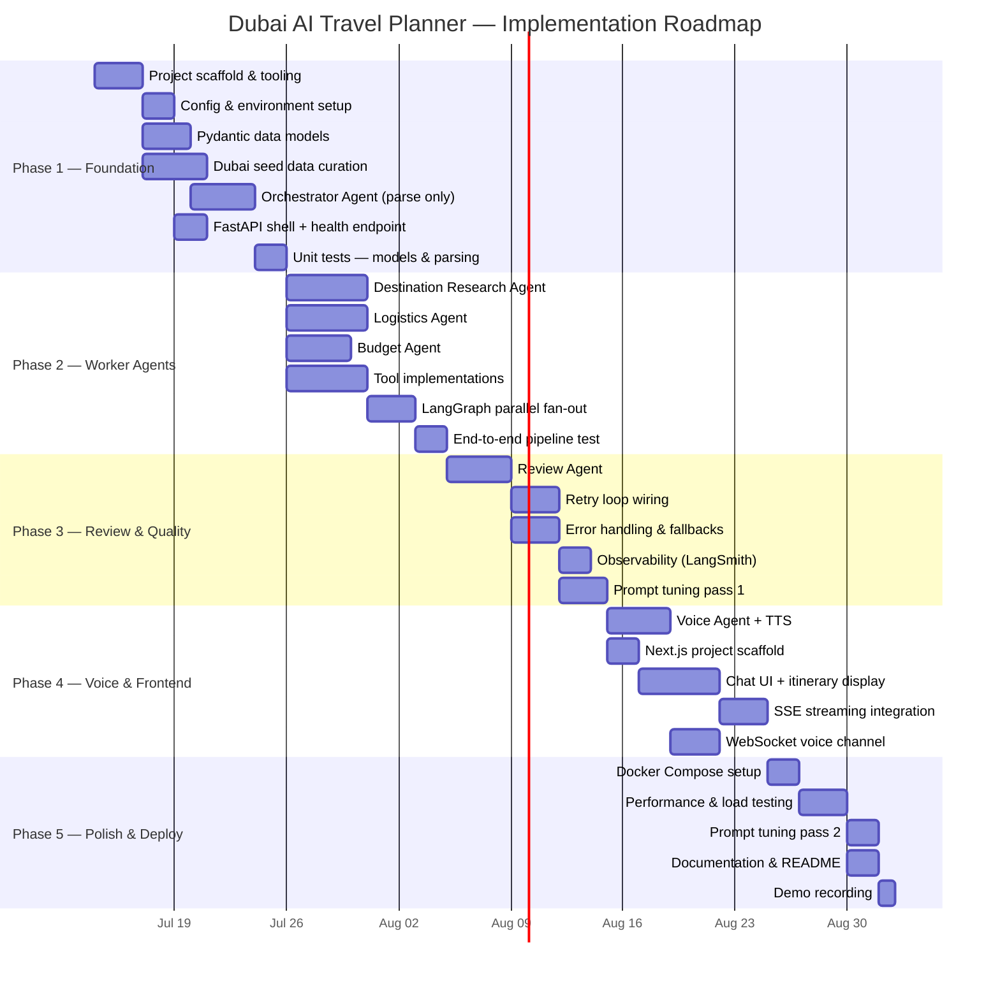

# Implementation Plan — Dubai AI Travel Planner (Multi-Agent System)

> **References:**
> - [architecture.md](file:///d:/MAS/docs/architecture.md)
> - [problemStatement.md](file:///d:/MAS/docs/problemStatement.md)
>
> **Scope:** Dubai-only, V1
> **Estimated Timeline:** 8 weeks (5 phases)

---

## Phase Overview



---

## Phase 1 — Foundation (Weeks 1–2)

**Goal:** Establish the project scaffold, data models, seed data, and a working Orchestrator that can parse natural-language requests into structured `TravelRequest` objects.

---

### 1.1 Project Scaffold & Tooling

**Tasks:**

- [ ] Initialise the `MAS/` repository structure as defined in [architecture.md §3](file:///d:/MAS/docs/architecture.md#L135)
- [ ] Create `pyproject.toml` with core dependencies:

  ```
  python = "^3.11"
  fastapi = "^0.115"
  uvicorn = "^0.30"
  langchain = "^0.3"
  langgraph = "^0.4"
  langchain-groq = "^0.3"              # Groq LLM (Orchestrator, Destination, Logistics, Budget)
  langchain-google-genai = "^0.3"       # Gemini LLM (Review Agent)
  pydantic = "^2.10"
  httpx = "^0.28"
  python-dotenv = "^1.1"
  beautifulsoup4 = "^4.12"              # Wikivoyage scraper
  lxml = "^5.3"                         # HTML parser for BS4
  ```

- [ ] Create `requirements.txt` as fallback
- [ ] Set up `.env.example` with placeholder keys:

  ```env
  GROQ_API_KEY=gsk_...
  GOOGLE_API_KEY=...                    # Gemini (Review Agent)
  SERPER_API_KEY=...
  GOOGLE_MAPS_API_KEY=...
  LANGSMITH_API_KEY=...
  ```

- [ ] Add `.gitignore` (Python + Node + `.env`)
- [ ] Create empty `__init__.py` files for all Python packages

**Deliverables:**

| Artifact | Path |
|---|---|
| Python project config | `pyproject.toml`, `requirements.txt` |
| Environment template | `.env.example` |
| Package structure | `src/agents/`, `src/graph/`, `src/tools/`, `src/models/`, `src/prompts/`, `src/data/`, `src/utils/` |

**Acceptance Criteria:**

- `pip install -e .` (or `uv sync`) succeeds with no errors
- All package directories importable (`from src.agents import ...`)

---

### 1.2 Configuration & Environment Setup

**Tasks:**

- [ ] Create [`src/config.py`](file:///d:/MAS/src/config.py) — centralised settings using `pydantic-settings`:

  ```python
  class Settings(BaseSettings):
      groq_api_key: str                                  # Groq (worker + orchestrator agents)
      google_api_key: str                                # Gemini (review agent)
      serper_api_key: str
      google_maps_api_key: str
      groq_model: str = "llama-3.3-70b-versatile"        # Orchestrator, Destination, Logistics, Budget
      gemini_model: str = "gemini-2.5-flash"             # Review Agent
      max_review_retries: int = 2
      default_destination: str = "Dubai"
      wikivoyage_url: str = "https://en.wikivoyage.org/wiki/Dubai"
      log_level: str = "INFO"

      model_config = SettingsConfigDict(env_file=".env")
  ```

- [ ] Create [`src/utils/logger.py`](file:///d:/MAS/src/utils/logger.py) — structured JSON logging with `structlog` or stdlib

**Deliverables:**

| Artifact | Path |
|---|---|
| Settings module | `src/config.py` |
| Logger utility | `src/utils/logger.py` |

**Acceptance Criteria:**

- `Settings()` loads from `.env` without error
- Logger outputs structured JSON to stdout

---

### 1.3 Pydantic Data Models

**Tasks:**

- [ ] Create [`src/models/request.py`](file:///d:/MAS/src/models/request.py) — `TravelRequest` schema (see [architecture.md §4.1](file:///d:/MAS/docs/architecture.md#L196))
- [ ] Create [`src/models/itinerary.py`](file:///d:/MAS/src/models/itinerary.py) — `Activity`, `DayPlan`, `AccommodationPlan`, `Itinerary` schemas (see [architecture.md §4.2](file:///d:/MAS/docs/architecture.md#L220))
- [ ] Create [`src/models/budget.py`](file:///d:/MAS/src/models/budget.py) — `BudgetCategory`, `BudgetBreakdown` schemas (see [architecture.md §4.3](file:///d:/MAS/docs/architecture.md#L249))
- [ ] Create [`src/models/review.py`](file:///d:/MAS/src/models/review.py) — `ReviewCheck`, `ReviewResult` schemas (see [architecture.md §4.4](file:///d:/MAS/docs/architecture.md#L266))
- [ ] Create [`src/models/destination.py`](file:///d:/MAS/src/models/destination.py) — `Attraction`, `Neighborhood`, `DestinationReport`
- [ ] Create [`src/models/logistics.py`](file:///d:/MAS/src/models/logistics.py) — `AccommodationOption`, `TransportSegment`, `LogisticsPlan`

**Deliverables:**

| Artifact | Path |
|---|---|
| All Pydantic models | `src/models/*.py` |

**Acceptance Criteria:**

- Every model can be instantiated with example data and serialised to JSON
- Validators enforce constraints (`duration_days >= 1`, `budget_usd > 0`, etc.)
- Unit tests pass for all model schemas

---

### 1.4 Dubai Data — Wikivoyage Scraper & Seed Pipeline

> [!IMPORTANT]
> **Data source change:** Instead of hand-curated mock JSON, we scrape **real travel data** from [Wikivoyage — Dubai](https://en.wikivoyage.org/wiki/Dubai) (CC BY-SA 3.0 licensed). The scraper parses the wiki page into structured JSON files that the agents consume.

**Source page sections → output mapping:**

| Wikivoyage Section | Output JSON | Agent Consumer |
|---|---|---|
| *See*, *Do* | `dubai_attractions.json` | Destination Research |
| *Eat*, *Drink* | `dubai_food.json` | Destination Research |
| *Sleep* | `dubai_hotels.json` | Logistics |
| *Get around* (Metro, Taxi, Bus, Tram, Boat) | `dubai_transport.json` | Logistics |
| *Buy* | `dubai_shopping.json` | Destination Research, Budget |
| *Budget*, *Mid-range*, *Splurge* (within Eat/Sleep) | `dubai_budget_tiers.json` | Budget |
| *Districts* | `dubai_neighborhoods.json` | All agents |

**Tasks:**

- [ ] Create [`src/tools/scraper.py`](file:///d:/MAS/src/tools/scraper.py) — Wikivoyage scraper:
  - Uses `httpx` + `beautifulsoup4` (with `lxml` parser)
  - Fetches `https://en.wikivoyage.org/wiki/Dubai`
  - Parses each section (See, Do, Eat, Drink, Sleep, Get around, Buy) into structured listings
  - Extracts: name, description, address, price range, phone, coordinates (where available)
  - Handles Wikivoyage listing markup (`.vcard` / `.listing-*` classes)
  - Outputs normalised JSON files to `src/data/`
  - Includes a `--refresh` CLI flag to re-scrape and update data

- [ ] Create [`src/data/dubai_neighborhoods.json`](file:///d:/MAS/src/data/dubai_neighborhoods.json) — scraped from Districts section + enriched with:
  - `name`, `aka`, `vibe`, `crowd_level`, `budget_tier`, `highlights`
  - Cover all budget tiers: luxury (Downtown, Palm Jumeirah), mid-range (Marina, JBR, Business Bay), budget (Deira, Al Barsha, Bur Dubai)

- [ ] Create [`src/data/dubai_attractions.json`](file:///d:/MAS/src/data/dubai_attractions.json) — scraped from See + Do sections:
  - `name`, `category`, `crowd_level`, `entry_fee_aed`, `recommended_duration_hours`, `best_time`, `neighborhood`, `description`, `source_url`
  - Categories: `architecture`, `food`, `culture`, `adventure`, `shopping`, `nature`, `nightlife`

- [ ] Create [`src/data/dubai_food.json`](file:///d:/MAS/src/data/dubai_food.json) — scraped from Eat + Drink sections:
  - `name`, `cuisine`, `price_range`, `budget_tier` (Budget / Mid-range / Splurge), `neighborhood`, `description`, `address`

- [ ] Create [`src/data/dubai_hotels.json`](file:///d:/MAS/src/data/dubai_hotels.json) — scraped from Sleep section:
  - `name`, `neighborhood`, `stars`, `price_range`, `budget_tier`, `description`, `address`, `phone`

- [ ] Create [`src/data/dubai_transport.json`](file:///d:/MAS/src/data/dubai_transport.json) — scraped from Get around section:
  - Metro (lines, fares, operating hours), Tram, Monorail, Taxi (flag fall, per-km), Bus, Boat (abra fares), ride-hail providers

- [ ] Create [`src/data/dubai_shopping.json`](file:///d:/MAS/src/data/dubai_shopping.json) — scraped from Buy section:
  - `name`, `type` (mall / souk / market), `neighborhood`, `description`

**Deliverables:**

| Artifact | Path | Source |
|---|---|---|
| Wikivoyage scraper | `src/tools/scraper.py` | — |
| Neighborhoods | `src/data/dubai_neighborhoods.json` | Districts section |
| Attractions | `src/data/dubai_attractions.json` | See + Do sections |
| Food & Drink | `src/data/dubai_food.json` | Eat + Drink sections |
| Hotels | `src/data/dubai_hotels.json` | Sleep section |
| Transport | `src/data/dubai_transport.json` | Get around section |
| Shopping | `src/data/dubai_shopping.json` | Buy section |

**Acceptance Criteria:**

- `python -m src.tools.scraper` fetches and parses the Wikivoyage page successfully
- All output JSON files pass schema validation against their Pydantic model counterparts
- Data covers all budget tiers (Budget / Mid-range / Splurge) and preference categories
- Scraper handles network failures gracefully (uses cached HTML as fallback)
- Attribution: all data files include a `_source` field linking back to the Wikivoyage page

---

### 1.5 Orchestrator Agent — Parse Request

**Tasks:**

- [ ] Create prompt template [`src/prompts/orchestrator.md`](file:///d:/MAS/src/prompts/orchestrator.md):
  - System role definition
  - Input: raw user query (string)
  - Output: `TravelRequest` JSON
  - Rules: default to Dubai, extract all constraints, handle ambiguous input gracefully
  - Dubai-specific knowledge section

- [ ] Implement [`src/agents/orchestrator.py`](file:///d:/MAS/src/agents/orchestrator.py):

  ```python
  class OrchestratorAgent:
      """
      Phase 1: Parses NL query → TravelRequest.
      Phase 2+: Will also assemble itinerary and handle retries.
      """
      def __init__(self, llm, prompt_path: str)
      async def parse_request(self, raw_query: str) -> TravelRequest
      # Future: async def assemble_itinerary(...)
      # Future: async def handle_review_feedback(...)
  ```

- [ ] Wire into a minimal LangGraph:

  ```python
  # src/graph/builder.py — Phase 1 version
  graph.add_node("parse_request", parse_request_node)
  graph.add_edge(START, "parse_request")
  graph.add_edge("parse_request", END)
  ```

**Deliverables:**

| Artifact | Path |
|---|---|
| Orchestrator prompt | `src/prompts/orchestrator.md` |
| Orchestrator agent | `src/agents/orchestrator.py` |
| Graph state schema | `src/graph/state.py` |
| Graph builder (v1) | `src/graph/builder.py` |
| Graph nodes (v1) | `src/graph/nodes.py` |

**Acceptance Criteria:**

- Given `"Plan a 5-day trip to Dubai. $3,000 budget. Love food and architecture, hate crowds."`, produces a valid `TravelRequest` with:
  - `destination = "Dubai"`, `duration_days = 5`, `budget_usd = 3000.0`
  - `preferences = ["food", "architecture"]`, `avoidances = ["crowds"]`
- Handles edge cases: missing budget, no preferences, non-Dubai destination → graceful default/error

---

### 1.6 FastAPI Shell

**Tasks:**

- [ ] Create [`src/main.py`](file:///d:/MAS/src/main.py):
  - `GET /api/v1/health` → `{"status": "ok"}`
  - `POST /api/v1/plan` → accepts `{"query": "..."}`, calls Orchestrator, returns `TravelRequest` (Phase 1 only)
  - CORS middleware for frontend dev
  - Lifespan handler to initialise LLM clients and compile graph

**Deliverables:**

| Artifact | Path |
|---|---|
| FastAPI app | `src/main.py` |

**Acceptance Criteria:**

- `uvicorn src.main:app --reload` starts without errors
- `GET /api/v1/health` returns 200
- `POST /api/v1/plan` returns a valid `TravelRequest` JSON

---

### 1.7 Unit Tests — Phase 1

**Tasks:**

- [ ] `tests/unit/test_models.py` — Schema validation for all Pydantic models
- [ ] `tests/unit/test_orchestrator.py` — Mock LLM, verify parse output for 5+ query variants
- [ ] `tests/unit/test_seed_data.py` — Validate all JSON seed files against models

**Acceptance Criteria:**

- `pytest tests/unit/` passes with 100% green
- Code coverage ≥ 80% for `src/models/` and `src/agents/orchestrator.py`

---

### Phase 1 — Exit Criteria Summary

> [!IMPORTANT]
> Phase 1 is complete when:
> 1. Project runs locally (`uvicorn` starts, health check passes)
> 2. A natural-language query is parsed into a structured `TravelRequest` (via **Groq LLM**)
> 3. Wikivoyage scraper runs and produces all seed data JSON files
> 4. All unit tests pass

---

## Phase 2 — Worker Agents (Weeks 3–4)

**Goal:** Build the three parallel worker agents (Destination, Logistics, Budget), their external tools, and wire them into a LangGraph with parallel fan-out/fan-in.

---

### 2.1 Tool Implementations

**Tasks:**

- [ ] [`src/tools/search.py`](file:///d:/MAS/src/tools/search.py) — Web search tool:
  - Wraps Serper or Tavily API
  - Input: query string → Output: list of search results (title, snippet, URL)
  - Fallback: return Wikivoyage-scraped Dubai data if API fails

- [ ] [`src/tools/maps.py`](file:///d:/MAS/src/tools/maps.py) — Google Maps tool:
  - `get_directions(origin, destination, mode)` → travel time, distance, steps
  - `get_place_details(place_name)` → rating, address, opening hours
  - Fallback: pre-computed distance matrix for common Dubai routes

- [ ] [`src/tools/hotels.py`](file:///d:/MAS/src/tools/hotels.py) — Hotel lookup tool:
  - Loads `dubai_hotels.json` (Wikivoyage-sourced)
  - `search_hotels(budget_tier, neighborhood=None)` → filtered list
  - V1: Wikivoyage data; interface designed for future API swap (Booking.com, etc.)

- [ ] [`src/tools/currency.py`](file:///d:/MAS/src/tools/currency.py) — Currency conversion tool:
  - Calls `exchangerate.host` for USD ↔ AED
  - Caches rate for 24 hours
  - Fallback: hardcoded rate (1 USD = 3.67 AED)

- [ ] Register all tools as LangChain `@tool` functions with proper docstrings

**Deliverables:**

| Artifact | Path | External Dep |
|---|---|---|
| Search tool | `src/tools/search.py` | Serper / Tavily API |
| Maps tool | `src/tools/maps.py` | Google Maps API |
| Hotels tool | `src/tools/hotels.py` | Wikivoyage JSON |
| Currency tool | `src/tools/currency.py` | exchangerate.host |

**Acceptance Criteria:**

- Each tool can be called independently and returns structured output
- Fallback paths work when APIs are unavailable
- Unit tests cover both success and fallback scenarios

---

### 2.2 Destination Research Agent

**Tasks:**

- [ ] Create prompt [`src/prompts/destination.md`](file:///d:/MAS/src/prompts/destination.md):
  - Role: Dubai destination expert
  - Input: `TravelRequest`
  - Output: `DestinationReport` JSON — list of recommended attractions, neighborhoods, food spots
  - Rules: annotate crowd levels, respect preferences/avoidances, separate must-do vs nice-to-have
  - Dubai-specific knowledge: seasonality (summer heat → indoor bias), Ramadan considerations

- [ ] Implement [`src/agents/destination.py`](file:///d:/MAS/src/agents/destination.py):

  ```python
  class DestinationResearchAgent:
      def __init__(self, llm, tools: list, prompt_path: str)
      # llm = ChatGroq(model="llama-3.3-70b-versatile")
      async def research(self, request: TravelRequest) -> DestinationReport
  ```

  - **LLM: Groq** (`llama-3.3-70b-versatile`)
  - Tools bound: `search_web`, `dubai_attractions` (Wikivoyage-sourced lookup)
  - Loads data from `dubai_attractions.json`, `dubai_food.json`, and `dubai_neighborhoods.json`

**Acceptance Criteria:**

- Given a food + architecture request, returns attractions tagged with those categories
- Crowd-averse requests exclude `crowd_level: "high"` items
- Output validates against `DestinationReport` schema

---

### 2.3 Logistics Agent

**Tasks:**

- [ ] Create prompt [`src/prompts/logistics.md`](file:///d:/MAS/src/prompts/logistics.md):
  - Role: Dubai logistics planner
  - Input: `TravelRequest` (+ `DestinationReport` once wired)
  - Output: `LogisticsPlan` JSON — accommodation options, daily route sequence, transport recommendations
  - Rules: minimise travel time, suggest Metro for Red/Green line routes, tier accommodation by budget

- [ ] Implement [`src/agents/logistics.py`](file:///d:/MAS/src/agents/logistics.py):

  ```python
  class LogisticsAgent:
      def __init__(self, llm, tools: list, prompt_path: str)
      # llm = ChatGroq(model="llama-3.3-70b-versatile")
      async def plan(self, request: TravelRequest, destinations: DestinationReport = None) -> LogisticsPlan
  ```

  - **LLM: Groq** (`llama-3.3-70b-versatile`)
  - Tools bound: `google_maps_directions`, `hotel_lookup`
  - Loads Wikivoyage-sourced data from `dubai_hotels.json` and `dubai_transport.json`

**Acceptance Criteria:**

- Suggests accommodation in the correct budget tier
- Daily activity sequence avoids backtracking (activities in same area grouped)
- Transport mode recommendations match Dubai Metro coverage

---

### 2.4 Budget Agent

**Tasks:**

- [ ] Create prompt [`src/prompts/budget.md`](file:///d:/MAS/src/prompts/budget.md):
  - Role: Dubai trip budget analyst
  - Input: `TravelRequest`
  - Output: `BudgetBreakdown` JSON
  - Rules: use Dubai default allocation (40/25/15/15/5), flag overspend, suggest alternatives
  - Dubai-specific: AED conversion, local price ranges

- [ ] Implement [`src/agents/budget.py`](file:///d:/MAS/src/agents/budget.py):

  ```python
  class BudgetAgent:
      def __init__(self, llm, tools: list, prompt_path: str)
      # llm = ChatGroq(model="llama-3.3-70b-versatile")
      async def analyze(self, request: TravelRequest) -> BudgetBreakdown
  ```

  - **LLM: Groq** (`llama-3.3-70b-versatile`)
  - Tools bound: `currency_convert`
  - Uses allocation heuristic from [architecture.md §5.4](file:///d:/MAS/docs/architecture.md#L368)
  - References Wikivoyage budget tier data (`dubai_budget_tiers.json`) for realistic price ranges

**Acceptance Criteria:**

- Budget categories sum to `budget_usd`
- `within_budget` flag correctly reflects estimated vs allocated
- Warnings generated when any category exceeds 120% of allocation
- Suggestions reference specific Dubai alternatives (e.g., "Deira instead of Downtown")

---

### 2.5 LangGraph — Parallel Fan-Out / Fan-In

**Tasks:**

- [ ] Update [`src/graph/state.py`](file:///d:/MAS/src/graph/state.py) — add fields for all worker outputs (see [architecture.md §6.1](file:///d:/MAS/docs/architecture.md#L430))

- [ ] Update [`src/graph/nodes.py`](file:///d:/MAS/src/graph/nodes.py) — add node functions for each worker agent:

  ```python
  async def destination_node(state: PlannerState) -> dict
  async def logistics_node(state: PlannerState) -> dict
  async def budget_node(state: PlannerState) -> dict
  ```

- [ ] Update [`src/graph/builder.py`](file:///d:/MAS/src/graph/builder.py) — wire parallel execution:

  ```python
  # Fan-out from parse_request
  graph.add_edge("parse_request", "destination_research")
  graph.add_edge("parse_request", "logistics")
  graph.add_edge("parse_request", "budget")

  # Fan-in to assembly (placeholder for Phase 3)
  graph.add_edge("destination_research", "assemble_itinerary")
  graph.add_edge("logistics", "assemble_itinerary")
  graph.add_edge("budget", "assemble_itinerary")
  graph.add_edge("assemble_itinerary", END)
  ```

- [ ] Implement `assemble_itinerary` node — Orchestrator combines worker outputs into draft `Itinerary`

**Acceptance Criteria:**

- All three worker agents execute **in parallel** (verified via trace timing)
- Assembly node receives all three outputs and produces a valid draft `Itinerary`
- Total pipeline latency < sum of individual agent latencies (proves parallelism)

---

### 2.6 End-to-End Pipeline Test

**Tasks:**

- [ ] Create `tests/integration/test_full_pipeline.py`:
  - Test with 3 distinct queries covering different budget tiers and preferences
  - Assert: valid `Itinerary` returned, all fields populated, budget coherent
  - Measure end-to-end latency

- [ ] Update `POST /api/v1/plan` to return the full draft `Itinerary` (not just `TravelRequest`)

**Acceptance Criteria:**

- Pipeline completes for all 3 test queries
- No schema validation errors in output
- Latency < 60 seconds per request

---

### Phase 2 — Exit Criteria Summary

> [!IMPORTANT]
> Phase 2 is complete when:
> 1. All three worker agents produce valid structured output
> 2. Fan-out runs in parallel; fan-in assembles a coherent draft itinerary
> 3. `POST /api/v1/plan` returns a complete day-by-day itinerary
> 4. Integration tests pass for 3+ query variants

---

## Phase 3 — Review & Quality (Week 5)

**Goal:** Add the Review Agent as a quality gate, implement the retry loop between Orchestrator and Review, harden error handling, and set up observability.

---

### 3.1 Review Agent

**Tasks:**

- [ ] Create prompt [`src/prompts/review.md`](file:///d:/MAS/src/prompts/review.md):
  - Role: Itinerary quality checker
  - Input: draft `Itinerary` + `TravelRequest` + `BudgetBreakdown`
  - Output: `ReviewResult` JSON
  - Validation checklist (6 checks from [architecture.md §5.5](file:///d:/MAS/docs/architecture.md#L395)):

    | # | Check | Fail Action |
    |---|---|---|
    | 1 | Day count matches `duration_days` | Reject |
    | 2 | Total cost ≤ `budget_usd` | Reject; attach overage |
    | 3 | All `preferences` represented | Warn; suggest additions |
    | 4 | No high-crowd activities when crowds avoided | Reject specific activities |
    | 5 | Travel times between activities < 60 min | Reject day; suggest reorder |
    | 6 | At least 3 meals per day | Warn |

- [ ] Implement [`src/agents/review.py`](file:///d:/MAS/src/agents/review.py):

  ```python
  class ReviewAgent:
      def __init__(self, llm, prompt_path: str)
      # llm = ChatGoogleGenerativeAI(model="gemini-2.5-flash")
      async def review(
          self,
          itinerary: Itinerary,
          request: TravelRequest,
          budget: BudgetBreakdown
      ) -> ReviewResult
  ```

  - **LLM: Google Gemini** (`gemini-2.5-flash`) — chosen for strong reasoning and evaluation capabilities
  - No tools — pure LLM evaluation
  - Returns `confidence_score: float` (0.0–1.0)

**Acceptance Criteria:**

- Correctly rejects an itinerary with 4 days when 5 were requested
- Correctly flags over-budget itineraries
- Correctly identifies missing preference coverage
- `confidence_score` correlates with number of passed checks

---

### 3.2 Retry Loop Wiring

**Tasks:**

- [ ] Implement `review_router` function in [`src/graph/nodes.py`](file:///d:/MAS/src/graph/nodes.py):

  ```python
  def review_router(state: PlannerState) -> str:
      if state["review_result"].approved:
          return "voice"  # Phase 4; END for now
      if state["retry_count"] < 2:
          return "retry"
      return "fail"
  ```

- [ ] Update [`src/graph/builder.py`](file:///d:/MAS/src/graph/builder.py):

  ```python
  graph.add_conditional_edges(
      "review",
      review_router,
      {"voice": END, "retry": "destination_research", "fail": END}  # voice wired in Phase 4
  )
  ```

- [ ] Update Orchestrator's `assemble_itinerary` to incorporate `revision_notes` from failed reviews
- [ ] Increment `retry_count` in state on each retry

**Acceptance Criteria:**

- An itinerary that fails review is retried with revision notes
- After 2 retries, the best-effort itinerary is returned with warnings
- `retry_count` never exceeds 2

---

### 3.3 Error Handling & Fallbacks

**Tasks:**

- [ ] **LLM malformed output** — wrap all LLM calls with:

  ```python
  async def safe_llm_call(llm, prompt, output_schema, retries=2):
      for attempt in range(retries + 1):
          try:
              result = await llm.ainvoke(prompt)
              return output_schema.model_validate_json(result.content)
          except ValidationError as e:
              if attempt == retries:
                  raise
              # Append error to prompt and retry
  ```

- [ ] **API failures** — implement fallback chain for each tool:

  | Tool | Primary | Fallback |
  |---|---|---|
  | Web search | Serper API | Wikivoyage-scraped data |
  | Maps directions | Google Maps API | Pre-computed distance matrix |
  | Currency conversion | exchangerate.host | Hardcoded 1 USD = 3.67 AED |
  | Hotel lookup | Wikivoyage JSON | Always available (local file) |
  | Groq LLM | Groq API | Retry with backoff (no secondary LLM) |
  | Gemini LLM | Gemini API | Retry with backoff (no secondary LLM) |

- [ ] **Non-Dubai destination** — early return from Orchestrator:

  ```python
  if request.destination.lower() != "dubai":
      return {"error": "Currently only Dubai is supported as a destination."}
  ```

- [ ] **Timeout protection** — per-agent timeout of 30 seconds; overall request timeout of 120 seconds

**Acceptance Criteria:**

- System returns a result (possibly degraded) even when all external APIs are down
- Non-Dubai requests are rejected with a clear message
- No unhandled exceptions propagate to the user

---

### 3.4 Observability Setup

**Tasks:**

- [ ] Integrate **LangSmith** (or Langfuse) for tracing:
  - Set `LANGCHAIN_TRACING_V2=true` in `.env`
  - Every agent invocation visible as a trace span
  - Token counts and costs tracked per agent

- [ ] Add structured logging at key points:

  | Log Point | Level | Data |
  |---|---|---|
  | Request received | INFO | session_id, raw_query |
  | Agent started | INFO | agent_name, input summary |
  | Agent completed | INFO | agent_name, latency_ms, token_count |
  | Tool called | DEBUG | tool_name, input, output summary |
  | Review result | INFO | approved, confidence_score, retry_count |
  | Error / fallback | WARN | error_type, fallback_used |

- [ ] Create a simple metrics endpoint `GET /api/v1/metrics` (optional) — returns request count, avg latency, review pass rate

**Acceptance Criteria:**

- Every request produces a complete trace in LangSmith
- Logs are JSON-structured and include all key fields
- Per-agent latency is visible in traces

---

### 3.5 Prompt Tuning — Pass 1

**Tasks:**

- [ ] Run 10 diverse test queries through the full pipeline
- [ ] Identify common failure patterns in LangSmith traces:
  - Missing fields in agent output
  - Hallucinated attractions or prices
  - Poor budget allocation
  - Review rejecting valid itineraries (false negatives)
- [ ] Iterate on prompt templates to fix top 5 issues
- [ ] Document prompt changes and rationale in a `docs/prompt-changelog.md`

**Acceptance Criteria:**

- Review pass rate ≥ 70% on first attempt across 10 test queries
- No critical hallucinations (fictitious Dubai landmarks)

---

### Phase 3 — Exit Criteria Summary

> [!IMPORTANT]
> Phase 3 is complete when:
> 1. Review Agent validates itineraries against the 6-check rubric
> 2. Retry loop produces improved itineraries on second attempt
> 3. System gracefully handles all error scenarios (API down, bad LLM output, non-Dubai)
> 4. Full request traces visible in LangSmith
> 5. Review pass rate ≥ 70% on first attempt

---

## Phase 4 — Voice & Frontend (Weeks 6–7)

**Goal:** Add the Voice Agent for conversational output, build the Next.js frontend with chat UI and itinerary display, and wire up SSE streaming and WebSocket voice.

---

### 4.1 Voice Agent + TTS

**Tasks:**

- [ ] Create prompt [`src/prompts/voice.md`](file:///d:/MAS/src/prompts/voice.md):
  - Role: Friendly travel assistant narrator
  - Input: approved `Itinerary`
  - Output: conversational text (spoken-style, warm, concise)
  - Rules: highlight key experiences, use day-by-day structure, avoid technical jargon

- [ ] Implement [`src/agents/voice.py`](file:///d:/MAS/src/agents/voice.py):

  ```python
  class VoiceAgent:
      def __init__(self, llm, tts_tool, prompt_path: str)
      async def narrate(self, itinerary: Itinerary) -> str  # text
      async def speak(self, text: str) -> bytes  # audio
      async def answer_followup(self, question: str, itinerary: Itinerary) -> str
  ```

- [ ] Implement [`src/tools/tts.py`](file:///d:/MAS/src/tools/tts.py):
  - Primary: Google Cloud TTS (if key available)
  - Fallback: browser-native Web Speech API (frontend-side)
  - Returns audio bytes (MP3/OGG)

- [ ] Wire Voice Agent as the final node in LangGraph:

  ```python
  graph.add_edge("review", "voice")  # only on approved path
  graph.add_edge("voice", END)
  ```

**Acceptance Criteria:**

- Voice output is a natural, friendly narration of the itinerary
- TTS produces playable audio
- Follow-up questions answered correctly in context

---

### 4.2 Next.js Frontend — Scaffold

**Tasks:**

- [ ] Initialise Next.js project in `frontend/`:

  ```bash
  npx -y create-next-app@latest ./ --ts --app --eslint --src-dir --no-tailwind
  ```

- [ ] Install dependencies: `axios` (or `ky`), `lucide-react` (icons)
- [ ] Set up API client helper in `frontend/lib/api.ts`
- [ ] Create base layout with:
  - Dark-mode theme
  - Google Font: Inter or Outfit
  - Responsive container
  - Gradient accent colours

**Acceptance Criteria:**

- `npm run dev` starts at `localhost:3000`
- Base layout renders with correct fonts and dark theme

---

### 4.3 Chat UI + Itinerary Display

**Tasks:**

- [ ] **`ChatInput.tsx`** — text input with send button; optional mic button (for voice)
- [ ] **`ItineraryCard.tsx`** — renders the full itinerary:
  - Title, summary
  - Day-by-day timeline (collapsible)
  - Activity cards with icons, time, cost, crowd badge
- [ ] **`DayTimeline.tsx`** — vertical timeline for a single day's activities
- [ ] **`BudgetSummary.tsx`** — visual budget breakdown:
  - Category bars (progress-style)
  - Total vs budget comparison
  - Warning badges for overspend
- [ ] **`VoiceButton.tsx`** — play/pause button for TTS audio
- [ ] **Main page (`app/page.tsx`)** — assembles all components:
  - Chat input at bottom
  - Itinerary display area (scrollable)
  - Loading states with skeleton UI and agent-step indicators

**Acceptance Criteria:**

- User can type a query and see a loading state
- Itinerary renders with all days, activities, and budget breakdown
- Responsive on mobile and desktop
- Visual design matches premium aesthetic guidelines

---

### 4.4 SSE Streaming Integration

**Tasks:**

- [ ] Update `POST /api/v1/plan` to support **Server-Sent Events (SSE)**:
  - Stream agent progress events: `{"event": "agent_started", "agent": "destination_research"}`
  - Stream partial results as they arrive
  - Final event: `{"event": "complete", "data": <full itinerary>}`

- [ ] Create [`src/utils/streaming.py`](file:///d:/MAS/src/utils/streaming.py):

  ```python
  async def stream_plan(graph, query: str):
      async for event in graph.astream_events({"raw_query": query}):
          yield format_sse(event)
  ```

- [ ] Update frontend to consume SSE:
  - Show real-time agent status ("Researching destinations…", "Checking budget…")
  - Progressively render itinerary sections as they arrive

**Acceptance Criteria:**

- Frontend shows live progress updates during plan generation
- Itinerary sections appear incrementally (not all at once)
- Connection handles reconnection gracefully

---

### 4.5 WebSocket Voice Channel

**Tasks:**

- [ ] Implement `WS /ws/v1/voice/{session_id}` in FastAPI:
  - Client sends: text question or audio blob
  - Server responds: text answer + audio bytes
  - Maintains session context (approved itinerary)

- [ ] Update `VoiceButton.tsx` to:
  - Capture mic input via Web Speech API → send as text
  - Play received audio response
  - Show transcript of spoken output

**Acceptance Criteria:**

- User can click mic, speak a question, and hear a spoken response
- Follow-up questions work within the context of the generated itinerary
- Fallback to text-only works when mic is unavailable

---

### Phase 4 — Exit Criteria Summary

> [!IMPORTANT]
> Phase 4 is complete when:
> 1. Full pipeline: type query → see streaming progress → view itinerary → hear narration
> 2. Follow-up questions work via voice or text
> 3. Frontend is responsive, visually polished, and dark-themed
> 4. SSE streaming shows real-time agent progress
> 5. Voice works end-to-end (input + output)

---

## Phase 5 — Polish & Deploy (Week 8)

**Goal:** Containerise the application, run performance tests, do a final round of prompt tuning, complete documentation, and record a demo.

---

### 5.1 Docker Compose Setup

**Tasks:**

- [ ] Create [`Dockerfile`](file:///d:/MAS/Dockerfile) (Python API):

  ```dockerfile
  FROM python:3.11-slim
  WORKDIR /app
  COPY pyproject.toml requirements.txt ./
  RUN pip install --no-cache-dir -r requirements.txt
  COPY src/ ./src/
  CMD ["uvicorn", "src.main:app", "--host", "0.0.0.0", "--port", "8000"]
  ```

- [ ] Create `frontend/Dockerfile` (Next.js):

  ```dockerfile
  FROM node:20-alpine
  WORKDIR /app
  COPY package*.json ./
  RUN npm ci
  COPY . .
  RUN npm run build
  CMD ["npm", "start"]
  ```

- [ ] Create [`docker-compose.yml`](file:///d:/MAS/docker-compose.yml):

  ```yaml
  services:
    api:
      build: .
      ports: ["8000:8000"]
      env_file: .env
    frontend:
      build: ./frontend
      ports: ["3000:3000"]
      environment:
        - NEXT_PUBLIC_API_URL=http://api:8000
    redis:
      image: redis:7-alpine
      ports: ["6379:6379"]
  ```

- [ ] Test full stack startup: `docker compose up --build`

**Acceptance Criteria:**

- `docker compose up` starts all three services
- Frontend at `:3000` can communicate with API at `:8000`
- Environment variables injected correctly from `.env`

---

### 5.2 Performance & Load Testing

**Tasks:**

- [ ] Measure baseline latency for 10 requests:

  | Metric | Target |
  |---|---|
  | End-to-end latency (median) | < 45 seconds |
  | End-to-end latency (p95) | < 90 seconds |
  | Time to first SSE event | < 5 seconds |
  | Per-agent latency (median) | < 15 seconds |

- [ ] Identify bottlenecks in LangSmith traces
- [ ] Optimise:
  - Groq is already fast (< 2s TTFT typical); verify worker agents meet latency targets
  - Evaluate Gemini model size for Review Agent (Flash vs Pro) based on quality vs speed
  - Reduce prompt length where possible
  - Cache Wikivoyage-scraped data lookups (in-memory at startup)

- [ ] (Optional) Run 3 concurrent requests to verify no race conditions in state management

**Acceptance Criteria:**

- Median E2E latency < 45 seconds
- No errors under 3 concurrent requests
- No memory leaks during sustained usage

---

### 5.3 Prompt Tuning — Pass 2

**Tasks:**

- [ ] Run 20 diverse test queries (expand from Phase 3's 10):
  - Different budget tiers ($500, $1,500, $3,000, $10,000)
  - Different preferences (adventure, nightlife, family, luxury, solo)
  - Different durations (2 days, 5 days, 10 days)
  - Edge cases (very low budget, conflicting preferences)

- [ ] Evaluate output quality:

  | Criterion | Target |
  |---|---|
  | Review pass rate (first attempt) | ≥ 85% |
  | No hallucinated landmarks | 100% |
  | Budget accuracy (±10% of target) | ≥ 90% |
  | Preference coverage | ≥ 90% |

- [ ] Update prompts to address remaining issues
- [ ] Update `docs/prompt-changelog.md`

**Acceptance Criteria:**

- All quality targets met across 20 test queries
- Prompts finalised and documented

---

### 5.4 Documentation & README

**Tasks:**

- [ ] Create [`README.md`](file:///d:/MAS/README.md):
  - Project overview and architecture diagram
  - Prerequisites (Python 3.11+, Node 20+, API keys)
  - Quick start guide (local + Docker)
  - API reference (link to auto-generated docs at `/docs`)
  - Agent descriptions with examples
  - Contributing guide

- [ ] Review and finalise:
  - [problemStatement.md](file:///d:/MAS/docs/problemStatement.md)
  - [architecture.md](file:///d:/MAS/docs/architecture.md)
  - `docs/prompt-changelog.md`

- [ ] Add inline code documentation:
  - Docstrings for all public classes and methods
  - Type hints throughout

**Acceptance Criteria:**

- A new developer can set up the project using only README instructions
- All public APIs documented
- `mkdocs` or equivalent can render docs (optional)

---

### 5.5 Demo Recording

**Tasks:**

- [ ] Record a 3–5 minute demo video showing:
  1. User types a travel request in the chat UI
  2. SSE streaming shows agent progress in real-time
  3. Full itinerary rendered with day timeline and budget
  4. Voice narration plays the itinerary
  5. User asks a follow-up question via voice
  6. LangSmith trace shown for the request

- [ ] Save demo to `docs/demo/` and embed in README

**Acceptance Criteria:**

- Demo covers the full user journey
- Video is clear, well-paced, and ≤ 5 minutes

---

### Phase 5 — Exit Criteria Summary

> [!IMPORTANT]
> Phase 5 is complete when:
> 1. `docker compose up` runs the full stack
> 2. Median latency < 45 seconds
> 3. Review pass rate ≥ 85% across 20 diverse queries
> 4. README enables cold-start setup
> 5. Demo video recorded and embedded

---

## Cross-Cutting Concerns (All Phases)

### Testing Strategy

| Level | Tool | Coverage Target | Phase |
|---|---|---|---|
| Unit tests | `pytest` | ≥ 80% for models, agents | 1–3 |
| Integration tests | `pytest` + real LLM | Full pipeline, 5+ queries | 2–3 |
| E2E tests | Playwright (optional) | Frontend → API → Response | 4–5 |
| Load tests | `locust` (optional) | 3 concurrent requests | 5 |

### Git Workflow

- **Branch naming:** `phase-{N}/{feature-name}` (e.g., `phase-2/destination-agent`)
- **Commits:** Conventional commits (`feat:`, `fix:`, `docs:`, `test:`)
- **PRs:** One per major task; squash-merge to `main`
- **Tags:** `v0.1.0` after Phase 1, `v0.2.0` after Phase 2, etc.

### Environment Management

| Environment | Purpose | Config |
|---|---|---|
| **Local** | Development | `.env` + `uvicorn --reload` |
| **Docker** | Integration testing | `docker-compose.yml` |
| **Staging** | Pre-release validation | Cloud VM + Docker Compose |
| **Production** | (Future) | Kubernetes |

---

## Risk Register

| Risk | Likelihood | Impact | Mitigation |
|---|---|---|---|
| LLM output quality inconsistent | High | Medium | Structured output + Pydantic validation + retries |
| Groq rate limits (free tier: 30 req/min) | Medium | Medium | Queue requests; add backoff; consider paid tier for production |
| Groq model limitations vs GPT-4o | Medium | Low | Use `llama-3.3-70b-versatile` for best quality; fall back to `llama-3.1-8b-instant` for speed |
| Gemini API quota exhaustion | Low | Medium | Review Agent is called once per request; low volume |
| Wikivoyage page structure changes | Low | Medium | Scraper uses defensive parsing; fallback to last-cached JSON |
| Wikivoyage data staleness | Low | Low | Re-scrape periodically; data is supplemented by web search tool |
| Google Maps API costs | Low | Medium | Pre-compute common Dubai routes; cache aggressively |
| Prompt injection via user query | Medium | High | Input sanitisation; system prompt hardening; never execute user text |
| Scope creep beyond Dubai | Low | Medium | Hard-scoped in Orchestrator; early rejection of non-Dubai requests |
| LangGraph version breaking changes | Low | Medium | Pin dependency versions; test on upgrade |

---

## Appendix A — File Manifest

| File | Phase | Description |
|---|---|---|
| `src/config.py` | 1 | Centralised settings |
| `src/main.py` | 1 | FastAPI entry point |
| `src/models/request.py` | 1 | TravelRequest schema |
| `src/models/itinerary.py` | 1 | Itinerary schemas |
| `src/models/budget.py` | 1 | Budget schemas |
| `src/models/review.py` | 1 | Review schemas |
| `src/models/destination.py` | 1 | Destination schemas |
| `src/models/logistics.py` | 1 | Logistics schemas |
| `src/agents/orchestrator.py` | 1 | Orchestrator Agent |
| `src/agents/destination.py` | 2 | Destination Research Agent |
| `src/agents/logistics.py` | 2 | Logistics Agent |
| `src/agents/budget.py` | 2 | Budget Agent |
| `src/agents/review.py` | 3 | Review Agent |
| `src/agents/voice.py` | 4 | Voice Agent |
| `src/graph/state.py` | 1 | Shared graph state |
| `src/graph/nodes.py` | 1–4 | Node functions |
| `src/graph/builder.py` | 1–4 | Graph construction |
| `src/tools/scraper.py` | 1 | Wikivoyage Dubai scraper |
| `src/tools/search.py` | 2 | Web search tool |
| `src/tools/maps.py` | 2 | Google Maps tool |
| `src/tools/hotels.py` | 2 | Hotel lookup tool (Wikivoyage data) |
| `src/tools/currency.py` | 2 | Currency tool |
| `src/tools/tts.py` | 4 | Text-to-speech tool |
| `src/prompts/*.md` | 1–4 | Agent prompts |
| `src/data/*.json` | 1 | Wikivoyage-scraped Dubai data |
| `src/utils/logger.py` | 1 | Structured logging |
| `src/utils/streaming.py` | 4 | SSE helpers |
| `frontend/` | 4 | Next.js web UI |
| `tests/` | 1–5 | Test suite |
| `Dockerfile` | 5 | API container |
| `docker-compose.yml` | 5 | Full stack compose |
| `README.md` | 5 | Project documentation |
