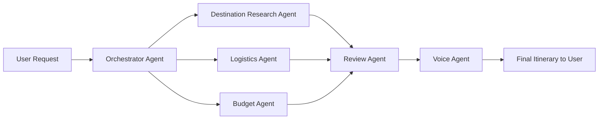

# Automations & Multi-Agent Systems — Problem Statement

## Background

Planning a trip sounds simple at first, but in practice it quickly becomes overwhelming.
A traveler may have a request like:

> "Plan a 5-day trip to Dubai. $3,000 budget. Love food and architecture, hate crowds."

To fulfill that well, we need to combine many different kinds of work:

- Understanding the traveler's goals
- Researching destinations and attractions
- Comparing hotels and transport options
- Staying within budget
- Checking whether the final itinerary actually matches the request

---

## Objective

Design a simple **Travel Planning Multi-Agent System** that can automatically turn a short travel request into a useful trip plan.

The goal is not to build a perfect travel product, but to show how multiple specialized AI agents can work together on a real-world problem that product managers can easily understand.

> [!IMPORTANT]
> **Initial Scope — Dubai only.** The first version of this system targets **Dubai, UAE** as the sole supported destination. All agent data sources, example prompts, and default recommendations are built around Dubai.

---

## Real-World Problem to Solve

### "AI Travel Planner"

A user gives a natural-language travel request such as:

> Plan a 5-day trip to Dubai. $3,000 budget. Love food and architecture, hate crowds.

The system should produce:

- A day-by-day trip outline
- Suggested neighborhoods / areas to stay
- Travel logistics within the city
- Budget-friendly recommendations
- A final itinerary that respects the user's preferences and constraints

---

## Multi-Agent System Design

### 1. Orchestrator Agent

**Role:** Creates the master plan, assigns work, and combines outputs into the final itinerary.

**What it does:**

- Reads the user request
- Extracts key constraints:
  - **Destination:** Dubai
  - **Duration:** 5 days (example)
  - **Budget:** $3,000 (example)
  - **Preferences:** food, architecture, etc.
  - **Avoidances:** crowds, etc.
- Delegates tasks to the other agents
- Synthesizes the final travel plan

---

### 2. Destination Research Agent

**Role:** Finds the best places, experiences, and food ideas based on the traveler's preferences.

**Possible inputs:**

- Web search
- Travel guides
- Restaurant reviews
- Attraction summaries

**What it does:**

- Recommends neighborhoods, landmarks, food streets, and local experiences
- Suggests less-crowded options where possible
- Identifies "must-do" vs "nice-to-have" items

**Example output (Dubai):**

- Best areas for traditional and modern architecture (Al Fahidi, Downtown, DIFC)
- Food neighborhoods (Al Seef, Deira, JBR)
- Off-peak or less-crowded experiences (weekday morning visits, hidden gems)

---

### 3. Logistics Agent

**Role:** Handles the practical side of moving and staying.

**Possible inputs:**

- Hotel APIs or sample hotel data
- Metro / bus / taxi transit info
- Maps / distance tools

**What it does:**

- Suggests where to stay in the city
- Estimates travel time between locations
- Recommends how to move between areas (Metro, taxi, ride-hail)
- Builds a realistic sequence for each day

**Example output (Dubai):**

- Stay in Downtown or Deira depending on budget
- Metro for major routes, taxis for off-grid spots
- Day plans that reduce backtracking

---

### 4. Budget Agent

**Role:** Ensures the plan stays within budget.

**Possible inputs:**

- Currency conversion (USD ↔ AED)
- Estimated hotel costs
- Food and transport price ranges
- Attraction pricing

**What it does:**

- Breaks the budget into categories:
  - Stay
  - Transport
  - Food
  - Activities
- Flags when the plan becomes too expensive
- Suggests cheaper alternatives

**Example output (Dubai):**

- Estimated total spend: $2,650
- Hotel cost too high in Downtown → suggest Deira or Al Barsha as alternatives

---

### 5. Review Agent

**Role:** Validates the final itinerary before it is shown to the user.

**What it checks:**

- Does the itinerary fit into the requested number of days?
- Is it within the stated budget?
- Does it align with the user's stated preferences (e.g., "food + architecture")?
- Does it try to avoid crowded experiences?
- Is the plan realistic from a travel-time perspective?

This agent acts like a **quality checker** before the result is delivered.

---

### 6. Voice Agent

**Role:** Interacts with the user and presents the final itinerary in a conversational format.

**What it does:**

- Receives input from the Orchestrator Agent
- Presents the final travel plan in a conversational format
- Can answer user queries about the itinerary
- Uses text-to-speech to speak the output

**Example output:**

> "Here is your 5-day travel plan for Dubai:
> Day 1: Arrive in Dubai…"

---

## Agent Execution Flow

```
Orchestrator → [Destination, Logistics, Budget in parallel] → Review → Voice
```


